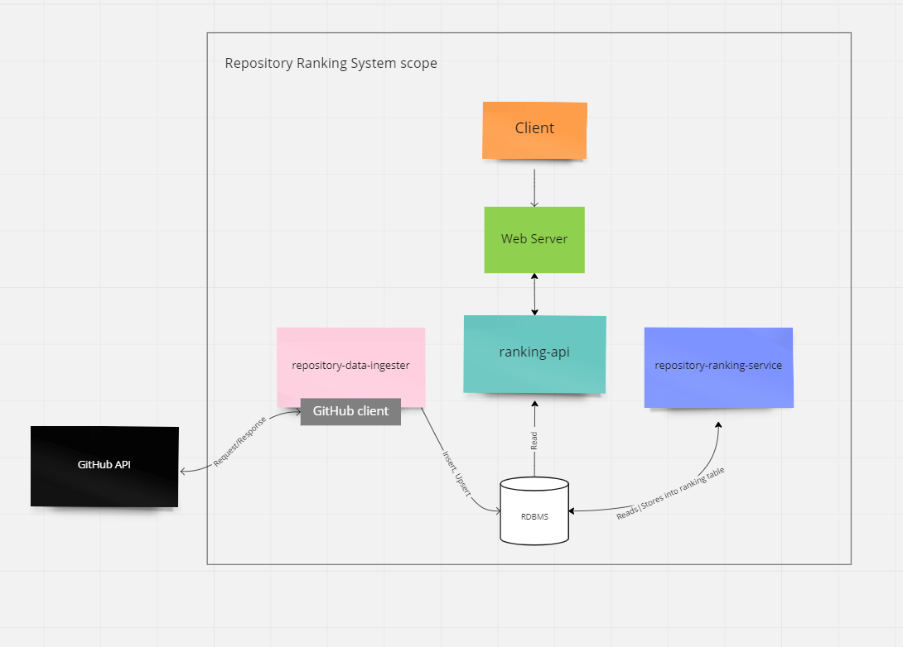

<<<<<<< HEAD
# Design GitHub repositories rank by given date range commits count

## Step 1: Outline use cases and constraints

> Gather requirements and scope the problem.
> Ask questions to clarify use cases and constraints.
> Discuss assumptions.

Without an interviewer to address clarifying questions, we'll define some use cases and constraints.

### Use cases

#### We'll scope the problem to handle only the following use case

* **Repository Data Ingester** ingests data needed for metrics to be calculated
* **Repository Ranking Service** updates ranking table looking up newly obtained data via repository-data-ingester into RDBMS
* **User** views the given period's most active repositories ranked by collected metrics from ranking-api
* **Repository Ranking Service** has high availability

#### Out of scope

* The general code versioning system
    * Design components only for calculating repositories rank

### Constraints and assumptions

#### State assumptions

* Traffic is not evenly distributed
* Commits/Issues/SecurityAdvisories can be in multiple repositories
* Commits/Issues/SecurityAdvisories cannot change repositories
* Metrics must be updated daily
    * More active repositories might need to be exported from more frequently
* ~ 10 million commits a day
* ~ 1 million issues created a day
* ~ 200 vulnerabilities a day
* ~ 10 million public repositories
* 330 million transactions per month
* 3 million read requests per month
* 110:1 write to read ratio

#### Calculate usage

**Clarify with your interviewer if you should run back-of-the-envelope usage calculations.**

* Size per row of **commit** table:
    * `sha` - 40 bytes
    * `created_at` - 8 bytes
    * `respository_id` - 8 bytes FK
    * Total: ~60 bytes
* Size per row of **issue** table:
    * `id` - 8 bytes
    * `state` - 1 byte (Boolean type either closed or open)
    * `created_at` - 8 bytes
    * `closed_at` - 8 bytes
    * `repository_id` - 8 bytes FK
    * Total: ~ 35 bytes
* Size per row of **vulnerability** table:
    * `id` - 8 bytes
    * `severity` - 6 bytes
    * `repository_id` - 8 bytes FK
    * Total: ~ 25 bytes
* Size per row of **repository** table:
    * `id` - 8 bytes
    * `project_name` - 290 bytes
    * `rank` - 8 bytes
      * > (owner) 39 bytes + (repository_name) 250 bytes + (delimiter'/') 1byte.
    * Total: ~ 300 bytes
* Grand Total: ~ 120 bytes (not considering repository table's transactions because they are inserted once before daily transactions)
* 16GB(Commits) + 1GB(Issues) + ~negligible GB(Vulnerabilities) of new transaction content per month (in case we don't delete anything)
    * ~ 17 GB of data per month
    * ~ 0.6 TB of new transaction content in 2 years
    * Assume most are new transactions instead of updates to existing ones
* 127 transactions per second on average
* 1.15 read requests per second on average

## Step 2: Create a high level design

> Outline a high level design with all important components.



## Step 3: Design core components

> Dive into details for each core component.

### Use case: Repository Ranking Service updates ranking table by newly obtained data via repository-data-ingester into RDBMS

We could store the newly obtained commits/issues/vulnerabilities via GitHubClient from **GitHubApi** in SQL RDBMS storage such as Amazon Aurora, 
rather than managing our own data storage. This also gives the possibility to scale out later on using sharding strategy.

**Clarify with your interviewer how much code you are expected to write**.

We'll assume this is a sample **commit** table rows:

```
   sha         created_at    respository_id    
   hash1       t1            1   
   hash2       t2            2   
   hash3       t3            3     
   hash4       t4            4    
   hash5       t5            5     
   hash6       t6            6
   ...
```

This is a sample **issue** table rows:
```
   id         state    created_at                    closed_at    
   string1    true     2023-02-09 19:23:39.000       2023-02-08 20:23:39.000
   string2    false    2023-02-08 18:23:39.000       null
   string3    true     2023-02-07 17:23:39.000       2023-02-08 19:23:39.000
   string4    false    2023-02-06 16:23:39.000       null
   string5    false    2023-02-05 15:23:39.000       null
   string6    true     2023-02-04 14:23:39.000       2023-02-08 19:23:39.000
   ...
```

This is a sample **vulnerability** table rows:
```
   id        severity    repository_id
   1         high        1
   2         moderate    1
   3         low         2
   ...
```

The **Repository Ranking Service** will be querying above tables to write the results into table `repository` being specific into `rank` column, 
`rank` column will be filled in after calculation of the **average resolution time**, **overall issues count**(bug history), **vulnerabilities count**.  We should discuss the [use cases and tradeoffs between choosing SQL or NoSQL](https://github.com/donnemartin/system-design-primer#sql-or-nosql).

We'll assume that ranking is done for last week(to store ranking results into **repository** table)
We'll use a JPA repository interface to get the certain ranking data for given period of time:

```java
public interface RankingRepository extends JpaRepository<Commit, Long> {
    @Query("SELECT COUNT(c) FROM Commit c WHERE c.repositoryId = :repositoryId AND c.createdAt BETWEEN :startDate AND :endDate")
    Long countCommitsByRepositoryIdAndDateRange(@Param("repositoryId") Long repositoryId, @Param("startDate") ZonedDateTime startDate, @Param("endDate") ZonedDateTime endDate);
    
    @Query("SELECT AVG(TIMESTAMPDIFF(SECOND, i.createdAt, i.closedAt))/3600 FROM Issue i WHERE i.repositoryId = :repositoryId AND i.state = true AND i.createdAt BETWEEN :startDate AND :endDate")
    Double getAverageResolutionTimeByRepositoryIdAndDateRange(@Param("repositoryId") Long repositoryId, @Param("startDate") ZonedDateTime startDate, @Param("endDate") ZonedDateTime endDate);
    
    @Query("SELECT COUNT(i) FROM Issue i WHERE i.repositoryId = :repositoryId AND i.createdAt BETWEEN :startDate AND :endDate")
    Long countIssuesByRepositoryIdAndDateRange(@Param("repositoryId") Long repositoryId, @Param("startDate") ZonedDateTime startDate, @Param("endDate") ZonedDateTime endDate);
    
    @Query("SELECT COUNT(v) FROM Vulnerability v WHERE v.repositoryId = :repositoryId AND v.severity = :severity")
    Long countVulnerabilitiesByRepositoryIdAndSeverity(@Param("repositoryId") Long repositoryId, @Param("severity") String severity);
}
```

To store the intermediate aggregation results of the Ranking Data, we can create a new table in the database, specifically designed to store the ranking information. This table would have columns to store the necessary information, such as repository ID, commits count, average issue resolution time, issues count, vulnerabilities count by each severity. We can name this table something like "RepositoryRanking" or similar. 
The RepositoryRankingService can then use the RankingRepository interface to access this table and retrieve the ranking information from it.
* **Step 1** - Retrieve these ranking metrics repository ID, commits count, average issue resolution time, issues count, vulnerabilities count by each severity using `RankingRepository`
* **Step 2** - Save the aggregated results into intermediate table with below columns:
  * `(repository_id, commits_count, average_issue_resolution_time, issues_count, vulnerabilities_count_high, vulnerabilities_count_moderate, vulnerabilities_count_low)`
* **Step 3** - Perform a distributed sort in Amazon Aurora with native query from another JpaRepository:
  * ```java
    public interface RankingDataSortedRepository extends JpaRepository<RankingData, Long> {
  
    @Query(value = "SELECT * FROM ranking_data ORDER BY commits_count DESC, average_issue_resolution_time ASC, issues_count ASC, vulnerabilities_count_high ASC, vulnerabilities_count_moderate ASC, vulnerabilities_count_low ASC", nativeQuery = true)
       List<RankingData> findAllSortedByRankingFactors();
    }
  * **Step 4** - Now we can use findAllSortedByRankingFactors to store ranks into `repository` table
    * ```java
      @Service
      public class RepositoryRankingService {
        private final RankingDataSortedRepository rankingDataSortedRepository;
        private final RepositoryRepository repositoryRepository;
  
        public RepositoryRankingService(RankingDataSortedRepository rankingDataSortedRepository, RepositoryRepository repositoryRepository) {
            this.rankingDataSortedRepository = rankingDataSortedRepository;
            this.repositoryRepository = repositoryRepository;
        }
  
        public void rankRepositories(LocalDateTime startDate, LocalDateTime endDate) {
            List<RankingData> rankingDataList = rankingDataSortedRepository.findAllSortedByRankingFactors(startDate, endDate);
            int rank = 1;
            for (RankingData rankingData : rankingDataList) {
                Repository repository = repositoryRepository.findById(rankingData.getRepositoryId()).get();
                repository.setRank(rank);
                repositoryRepository.save(repository);
                rank++;
            }
        }
      }
      ```

Resultant `repository` table will look like:
```
id           project_name                 rank
1            "project1"                   2
2            "project2"                   4
3            "project3"                   3
4            "project4"                   1
5            "project5"                   5
```


To speed up look-ups (log-time instead of scanning the entire table), the following indexes can be created assuming the commit, issue, and vulnerability tables mentioned above:


- For the **commit** table:
  - An index on the `repository_id` column, as this is likely to be frequently used for filtering and aggregating data.
  - An index on the `created_at` column, as this may be used for date-based filtering or aggregations.

- For the **issue** table:
  - An index on the `repository_id` column, as this is likely to be frequently used for filtering and aggregating data.
  - An index on the `state` column, as this may be used for filtering issues based on their state.
  - An index on the `created_at` column, as this may be used for date-based filtering or aggregations.
  - An index on the `closed_at` column, as this may be used for date-based filtering or aggregations.

- For the **vulnerability** table:
  - An index on the `repository_id` column, as this is likely to be frequently used for filtering and aggregating data.
  - An index on the `severity` column, as this may be used for filtering vulnerabilities based on their severity level.

### Use case: **User** views the past week's most active repositories ranked by collected metrics from ranking-api

* The **Client** sends a request to the **Web Server**, running as a [reverse proxy](https://github.com/donnemartin/system-design-primer#reverse-proxy-web-server)
* The **Web Server** forwards the request to the **ranking-api** server
* The **ranking-api** server reads from the **SQL Database** `repository` table

Example of controller to be defined in **ranking-api**
```java
@RestController
public class RankingController {

    private final RepositoryTableRepository repositoryTableRepository;

    public RankingController(RepositoryRepository repositoryRepository) {
        this.repositoryRepository = repositoryRepository;
    }

    @GetMapping("/ranks")
    public List<Repository> getRanks() {
        return repositoryRepository.findAllByOrderByRankAsc();
    }
}
```

We'll use a public **REST API** of **ranking-api** microservice
```shell
curl -X GET "https://ranking-api.mendix.com/ranks" -H "accept: application/json"
```

Response:

```json
[
  {
    "id": 2,
    "project_name": "Project B",
    "rank": 1
  },
  {
    "id": 3,
    "project_name": "Project C",
    "rank": 2
  },
  {
    "id": 1,
    "project_name": "Project A",
    "rank": 3
  }
]
```

## Step 4: Scale the design

> Identify and address bottlenecks, given the constraints.


**Important: Do not simply jump right into the final design from the initial design!**

State you would 1) **Benchmark/Load Test**, 2) **Profile** for bottlenecks 3) address bottlenecks while evaluating alternatives and trade-offs, and 4) repeat.  See [Design a system that scales to millions of users on AWS](../scaling_aws/README.md) as a sample on how to iteratively scale the initial design.

It's important to discuss what bottlenecks you might encounter with the initial design and how you might address each of them.  For example, what issues are addressed by adding a **Load Balancer** with multiple **Web Servers**?  **CDN**?  **Master-Slave Replicas**?  What are the alternatives and **Trade-Offs** for each?

We'll introduce some components to complete the design and to address scalability issues.  Internal load balancers are not shown to reduce clutter.

*To avoid repeating discussions*, refer to the following [system design topics](https://github.com/donnemartin/system-design-primer#index-of-system-design-topics) for main talking points, tradeoffs, and alternatives:

* [DNS](https://github.com/donnemartin/system-design-primer#domain-name-system) By distributing the incoming requests across multiple instances of the API, load balancing can help to ensure that the API remains responsive even during periods of high traffic. Additionally, if one instance of the API becomes unavailable, the DNS server can automatically redirect incoming requests to another available instance, improving the overall availability of the API.
* [Load balancer](https://github.com/donnemartin/system-design-primer#load-balancer) Introducing load balancers in between the client and the web server components can improve the availability and scalability of the system. Load balancers can distribute the incoming traffic across multiple instances of the web server, ensuring that no single instance becomes overwhelmed. This helps to improve the overall reliability and responsiveness of the system, and reduces the risk of downtime or slow performance. Load balancers also provide a single point of entry for the clients, allowing the underlying web servers to be updated, reconfigured or taken offline without affecting the availability of the service. This improves the maintainability of the system and makes it easier to scale the number of web servers as the demand for the service grows.
* [Horizontal scaling](https://github.com/donnemartin/system-design-primer#horizontal-scaling) Load balancers can also help with horizontal scaling, improving performance and availability. Scaling out using commodity machines is more cost efficient and results in higher availability than scaling up a single server on more expensive hardware, called Vertical Scaling. It is also easier to hire for talent working on commodity hardware than it is for specialized enterprise systems.
* [Web server (reverse proxy)](https://github.com/donnemartin/system-design-primer#reverse-proxy-web-server) A reverse proxy is a web server that centralizes internal services and provides unified interfaces to the public. Requests from clients are forwarded to a server that can fulfill it before the reverse proxy returns the server's response to the client.

  * Additional benefits include:

    * Increased security - Hide information about backend servers, blacklist IPs, limit number of connections per client
    * Increased scalability and flexibility - Clients only see the reverse proxy's IP, allowing you to scale servers or change their configuration
    * SSL termination - Decrypt incoming requests and encrypt server responses so backend servers do not have to perform these potentially expensive operations
    * Removes the need to install X.509 certificates on each server
    * Compression - Compress server responses
    * Caching - Return the response for cached requests
* [API server (application layer)](https://github.com/donnemartin/system-design-primer#application-layer) Separating out the web layer from the application layer (also known as platform layer) allows you to scale and configure both layers independently. Adding a new API results in adding application servers without necessarily adding additional web servers. The single responsibility principle advocates for small and autonomous services that work together. Small teams with small services can plan more aggressively for rapid growth.
* [Cache](https://github.com/donnemartin/system-design-primer#cache) 
* [Relational database management system (RDBMS)](https://github.com/donnemartin/system-design-primer#relational-database-management-system-rdbms)
* [SQL write master-slave failover](https://github.com/donnemartin/system-design-primer#fail-over)
* [Master-slave replication](https://github.com/donnemartin/system-design-primer#master-slave-replication)
* [Consistency patterns](https://github.com/donnemartin/system-design-primer#consistency-patterns)
* [Availability patterns](https://github.com/donnemartin/system-design-primer#availability-patterns)

The **Analytics Database** could use a data warehousing solution such as Amazon Redshift or Google BigQuery.

We might only want to store a limited time period of data in the database, removing old data by a job running daily from **sql write master-slave**, while storing the rest in a data warehouse.

1.15 read requests per second is not a load at all for Amazon RDS PostgreSQL or Aurora instances, to address the further rise of the average read requests per second (higher at peak), traffic for repository ranking data should be handled by the **Memory Cache** instead of the database.  
The **Memory Cache** is also useful for handling the unevenly distributed traffic and traffic spikes.  
With the large volume of reads, the **SQL Read Replicas** might not be able to handle the cache misses.  We'll probably need to employ additional SQL scaling patterns.

127 *average* writes per second on average (higher at peak) might be tough for a single **SQL Write Master-Slave**, also pointing to a need for additional scaling techniques.

SQL scaling patterns include:

* [Federation](https://github.com/donnemartin/system-design-primer#federation)
* [Sharding](https://github.com/donnemartin/system-design-primer#sharding)
* [Denormalization](https://github.com/donnemartin/system-design-primer#denormalization)
* [SQL Tuning](https://github.com/donnemartin/system-design-primer#sql-tuning)

We should also consider moving some data to a **NoSQL Database**.

## Additional talking points

> Additional topics to dive into, depending on the problem scope and time remaining.

#### NoSQL

* [Key-value store](https://github.com/donnemartin/system-design-primer#key-value-store)
* [Document store](https://github.com/donnemartin/system-design-primer#document-store)
* [Wide column store](https://github.com/donnemartin/system-design-primer#wide-column-store)
* [Graph database](https://github.com/donnemartin/system-design-primer#graph-database)
* [SQL vs NoSQL](https://github.com/donnemartin/system-design-primer#sql-or-nosql)

### Caching

* Where to cache
    * [Client caching](https://github.com/donnemartin/system-design-primer#client-caching)
    * [CDN caching](https://github.com/donnemartin/system-design-primer#cdn-caching)
    * [Web server caching](https://github.com/donnemartin/system-design-primer#web-server-caching)
    * [Database caching](https://github.com/donnemartin/system-design-primer#database-caching)
    * [Application caching](https://github.com/donnemartin/system-design-primer#application-caching)
* What to cache
    * [Caching at the database query level](https://github.com/donnemartin/system-design-primer#caching-at-the-database-query-level)
    * [Caching at the object level](https://github.com/donnemartin/system-design-primer#caching-at-the-object-level)
* When to update the cache
    * [Cache-aside](https://github.com/donnemartin/system-design-primer#cache-aside)
    * [Write-through](https://github.com/donnemartin/system-design-primer#write-through)
    * [Write-behind (write-back)](https://github.com/donnemartin/system-design-primer#write-behind-write-back)
    * [Refresh ahead](https://github.com/donnemartin/system-design-primer#refresh-ahead)

### Asynchronism and microservices

* [Message queues](https://github.com/donnemartin/system-design-primer#message-queues)
* [Task queues](https://github.com/donnemartin/system-design-primer#task-queues)
* [Back pressure](https://github.com/donnemartin/system-design-primer#back-pressure)
* [Microservices](https://github.com/donnemartin/system-design-primer#microservices)

### Communications

* Discuss tradeoffs:
    * External communication with clients - [HTTP APIs following REST](https://github.com/donnemartin/system-design-primer#representational-state-transfer-rest)
    * Internal communications - [RPC](https://github.com/donnemartin/system-design-primer#remote-procedure-call-rpc)
* [Service discovery](https://github.com/donnemartin/system-design-primer#service-discovery)

### Security

Refer to the [security section](https://github.com/donnemartin/system-design-primer#security).

### Latency numbers

See [Latency numbers every programmer should know](https://github.com/donnemartin/system-design-primer#latency-numbers-every-programmer-should-know).

### Ongoing

* Continue benchmarking and monitoring your system to address bottlenecks as they come up
* Scaling is an iterative process
